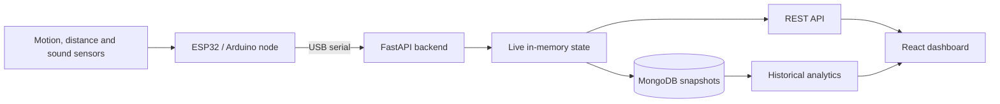

# Atmosense

<p align="center">
  <strong>Find a free study spot before you walk across campus.</strong>
</p>

<p align="center">
  A smart library occupancy and comfort system built at HackLondon 2026.
</p>

<p align="center">
  <a href="https://devpost.com/software/atmosense">Devpost</a>
  ·
  <a href="http://localhost:5173">Local dashboard</a>
  ·
  <a href="http://localhost:8000/docs">API docs</a>
</p>

---

## The problem

Finding somewhere to study on campus is often guesswork. A room may be labelled as a quiet zone but still be noisy, uncomfortably warm, or simply full by the time you arrive.

Atmosense makes those invisible conditions visible. Low-cost sensor nodes report whether desks are occupied and how the surrounding space feels, while a live dashboard helps students choose a suitable place before making the trip.

## What Atmosense does

- Shows live table and seat availability on an interactive library map.
- Combines motion, distance and sound readings to detect occupancy at the desk.
- Reports noise and temperature at both desk and room level.
- Recommends spaces for solo study or groups, including group-size matching.
- Separates quiet, mixed and collaborative zones.
- Stores periodic snapshots in MongoDB for occupancy, noise and comfort trends.
- Falls back to realistic demo data when live hardware or the backend is unavailable.
- Keeps sensor identity separate from room assignment, so a node can be moved without corrupting room analytics.

## How it works



Each physical node streams readings over serial. The backend associates the node's stable hardware ID with a desk and room, normalises its readings, and updates the live state used by the UI. MongoDB stores desk snapshots and room summaries for longer-term analytics.

The frontend polls the live table endpoint every two seconds. It merges available sensor readings with demo tables, renders the library heatmap, and ranks suitable tables based on study mode, group size, zone and free seats.

## The dashboard

Atmosense has two main views:

- **Live Map** — colour-coded tables, current availability, sensor details, zone filters and personalised recommendations.
- **Analytics** — room occupancy, average noise, average temperature and historical trends over 1, 7 or 14 days.

The MVP models three study environments:

| Room | Zone | Capacity |
| --- | --- | ---: |
| Floor 3 | Quiet | 6 desks |
| Ground Floor | Social / mixed | 6 desks |
| Level 2 | Collaborative | 7 desks |

## Tech stack

| Layer | Technology |
| --- | --- |
| Hardware | ESP32 / Arduino, motion, infrared distance and sound sensors |
| Firmware | C++ / Arduino |
| Backend | Python, FastAPI, Uvicorn, PySerial |
| Database | MongoDB with Motor |
| Frontend | React, TypeScript, Vite |
| Testing | Pytest, Vitest |

## Run locally

### Prerequisites

- Python 3.10+
- Node.js 18+
- MongoDB, unless you use demo-only mode
- An ESP32/Arduino node is optional; the app includes mock data

### 1. Clone the repository

```bash
git clone https://github.com/Duc5/AtmosenseHackLondon26.git
cd AtmosenseHackLondon26
```

### 2. Install the backend

```bash
cd backend
python -m venv .venv
```

Activate the environment:

```powershell
# Windows PowerShell
.\.venv\Scripts\Activate.ps1
```

```bash
# macOS / Linux
source .venv/bin/activate
```

Then install the dependencies:

```bash
pip install -r requirements.txt
```

### 3. Install the frontend

```bash
cd ../frontend
npm install
```

### 4. Start the services

Start MongoDB, then run the backend from `backend/`:

```bash
python -m uvicorn main:app --reload --host 127.0.0.1 --port 8000
```

In another terminal, run the frontend from `frontend/`:

```bash
npm run dev -- --host 127.0.0.1 --port 5173
```

Open:

- Dashboard: <http://127.0.0.1:5173>
- Interactive API docs: <http://127.0.0.1:8000/docs>
- Health check: <http://127.0.0.1:8000/api/health>

### Quick start on Windows

After installing the Python and frontend dependencies, the helper script starts MongoDB, the API and the dashboard:

```powershell
New-Item -ItemType Directory -Force .mongo-data | Out-Null
.\scripts\dev.ps1
```

Use `.\scripts\dev.ps1 -NoMongo` if MongoDB is already running elsewhere.

### Demo-only mode

To run without MongoDB, create `backend/.env`:

```env
MONGODB_REQUIRED=0
HISTORY_SEED_ENABLED=0
```

The live API, mock jitter and dashboard will still work. Historical MongoDB charts will be unavailable.

## Configuration

Backend settings can be placed in `backend/.env`:

| Variable | Default | Purpose |
| --- | --- | --- |
| `MONGODB_URI` | `mongodb://localhost:27017` | MongoDB connection string |
| `MONGODB_DB_NAME` | `spacesync` | Database name |
| `MONGODB_REQUIRED` | `true` | Fail startup when MongoDB is unavailable |
| `SERIAL_BAUD` | `9600` | Sensor-node serial baud rate |
| `SNAPSHOT_INTERVAL` | `600` | Seconds between desk snapshots |
| `ROOM_SNAPSHOT_INTERVAL` | `14400` | Seconds between room summaries |
| `SIMULATION_ENABLED` | `false` | Enable the serial simulation endpoint |

Optional frontend settings can be placed in `frontend/.env.local`:

```env
VITE_SEATSENSE_API_URL=http://localhost:8000
VITE_SEATSENSE_ENDPOINT_PATH=/api/tables
```

## Connect a sensor node

With the backend running, use the interactive API docs at <http://127.0.0.1:8000/docs>:

1. Connect the ESP32/Arduino over USB.
2. Call `GET /api/devices/scan` to find its stable hardware ID.
3. Call `POST /api/devices/register` with the hardware ID and a room, for example:

```json
{
  "hardware_id": "SN:YOUR_DEVICE_ID",
  "room_id": "room_a",
  "desk_id": "desk_1",
  "label": "Window desk"
}
```

4. The backend starts a serial listener and reconnects automatically if the USB port changes.

The serial reader accepts either a compact CSV reading:

```text
1,40,21.5
```

or the ESP32 key/value stream used by the prototype:

```text
sound_p2p=141,dBrel=17.0,sound=0,motion=1,distance_cm=42.3,occupied=1
```

The CSV fields are `occupied,noise_db,temp_c`. The current ESP32 key/value integration provides real occupancy and relative sound data; temperature remains a demo value until a physical temperature sensor is connected.

## API overview

| Endpoint | Description |
| --- | --- |
| `GET /api/tables` | Primary table-level contract used by the live map |
| `GET /api/rooms` | Live summaries for every room |
| `GET /api/rooms/{room_id}` | Room detail and desk filters |
| `GET /api/desks` | Live desk readings |
| `GET /api/analytics/summary` | Campus-wide live metrics |
| `GET /api/analytics/db/rooms/{room_id}/series` | Historical room time series |
| `GET /api/devices` | Registered nodes and connection status |
| `GET /api/health` | Service and sensor health |

The complete API, including device movement, desk history and analytics filters, is documented automatically at `/docs`.

## Project structure

```text
AtmosenseHackLondon26/
├── backend/
│   ├── app/api/          # Live data, devices, rooms and analytics routes
│   ├── app/db/           # MongoDB connection and repositories
│   ├── app/services/     # Serial ingestion, state, snapshots and mock data
│   ├── tests/
│   └── main.py
├── frontend/
│   ├── public/
│   └── src/              # React map, recommendations and analytics UI
├── scripts/              # Windows development launchers
└── README.md
```

## Tests

```bash
# Backend
cd backend
python -m pytest tests -q

# Frontend
cd ../frontend
npm run test
npm run build
```

## Built at HackLondon 2026

Atmosense was created in 24 hours for [HackLondon 2026](https://hacklondon-2026.devpost.com/) by:

- Alexander Girnus — backend and sensor-data pipeline
- Rafa Solih — ESP32 integration, GPIO planning and enclosure design
- Shafiyyah Alkatiri
- Tran Minh Duc

Read the full project story on [Devpost](https://devpost.com/software/atmosense).

## What's next

- Add networked nodes so multiple rooms can report without USB cables.
- Replace the prototype temperature value with a physical sensor reading.
- Expand from individual rooms to building- and campus-wide availability.
- Improve historical analytics and space-management insights.
- Adapt the system for public libraries, cafés, event venues and offices.
